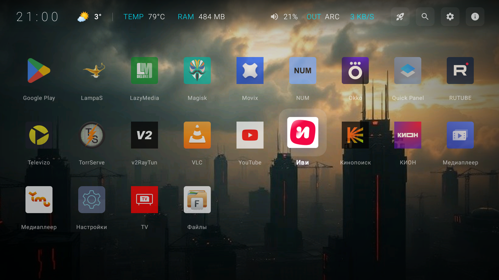
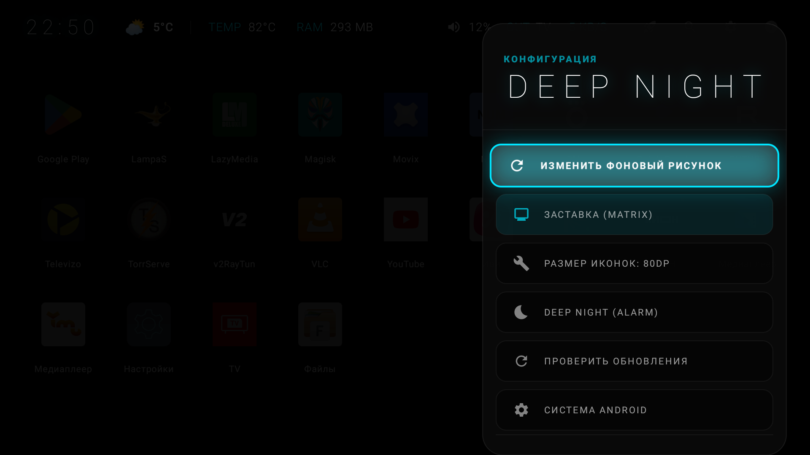

# Custom Launcher ROOT (DeepNight Launcher)

Персонализированный и оптимизированный лаунчер для Android TV / TV Box с глубокой интеграцией системных функций и поддержкой ROOT-прав.

## 📸 Скриншоты

  
  
  

## 🚀 Основные возможности

### 🛠 Системные функции и ROOT
- **Инфо-панель (Dashboard):** Отображение температуры процессора (CPU), свободной оперативной памяти (RAM) и текущей скорости интернет-соединения в реальном времени.
- **Оптимизация (Boost):** Очистка фоновых процессов и кэша системы одним нажатием (требуется ROOT) для максимальной производительности в играх и тяжелых приложениях.
- **Управление питанием:** Быстрый доступ к перезагрузке и выключению устройства через системные команды.
- **Исправление системных ошибок:** Автоматическое применение фиксов при старте (исправление разрешений, очистка системных лимитов).

### 🌐 Сеть и VPN
- **Встроенный VPN (АнтиЗапрет):** Интегрированный клиент OpenVPN для автоматического обхода блокировок. Работает автономно, используя локальный файл конфигурации (`antizapret.ovpn`).
- **Мониторинг сети:** Индикация активного VPN-соединения и автоматическое определение типа аудиовыхода (HDMI, ARC, Bluetooth, USB, AUX).

### 🌤 Погода и Геолокация
- **Автоматическая погода:** Определение местоположения по IP-адресу (точное определение города без GPS).
- **Информативный виджет:** Текущая температура, текстовое описание состояния погоды и динамические иконки.
- **Умные иконки:** Визуальное отображение условий (ясно, дождь, снег, туман, гроза) с учетом времени суток (день/ночь).

### 🎨 Интерфейс и Кастомизация
- **Jetpack Compose TV:** Современный интерфейс, полностью оптимизированный для управления пультом (D-Pad).
- **Динамические обои:** 
  - Поддержка установки фоновых изображений по прямой ссылке.
  - Приоритетное использование локального файла `custom_wallpaper.jpg`.
- **Голосовой поиск:** Мгновенный вызов системного голосового ассистента.
- **Индикация громкости:** Отображение текущего уровня громкости в процентах и статуса MUTE.

### 🔄 Система обновлений (OTA)
- **Авто-обновление:** Проверка новых версий через GitHub. При наличии обновления лаунчер предложит загрузить и установить актуальный APK.
- **Прозрачность:** Список изменений (changelog) отображается прямо в уведомлении об обновлении.

## 📦 Установка и настройка

1. Скачайте последнюю версию APK из раздела [Releases](https://github.com/Igor1974/Custom-Launcher-ROOT-/releases).
2. Установите на ваше Android TV устройство.
3. **ROOT-права:** Для работы функций "Boost" и управления питанием крайне рекомендуется предоставить приложению ROOT-доступ в Magisk/APatch.
4. **Кастомные обои:** Поместите файл `custom_wallpaper.jpg` во внутреннюю память устройства или укажите URL в настройках лаунчера.

## 🛠 Технический стек
- **Язык:** Kotlin
- **UI:** Jetpack Compose TV / Material 3
- **Network:** OkHttp 4 (погода и API), Coil (загрузка изображений)
- **Shell:** libsu (выполнение высокоуровневых ROOT-команд)
- **VPN:** Интегрированное ядро OpenVPN

---
**Разработчик:** Igor1974
**Текущая стабильная версия:** 5.0.1 (603)

<!-- Keywords: android tv launcher, tv box launcher, vpn, antizapret, root, boost, monitoring, jetpack compose, ota, deepnight, launcher for tv, 4pda, openvpn, leanback -->
