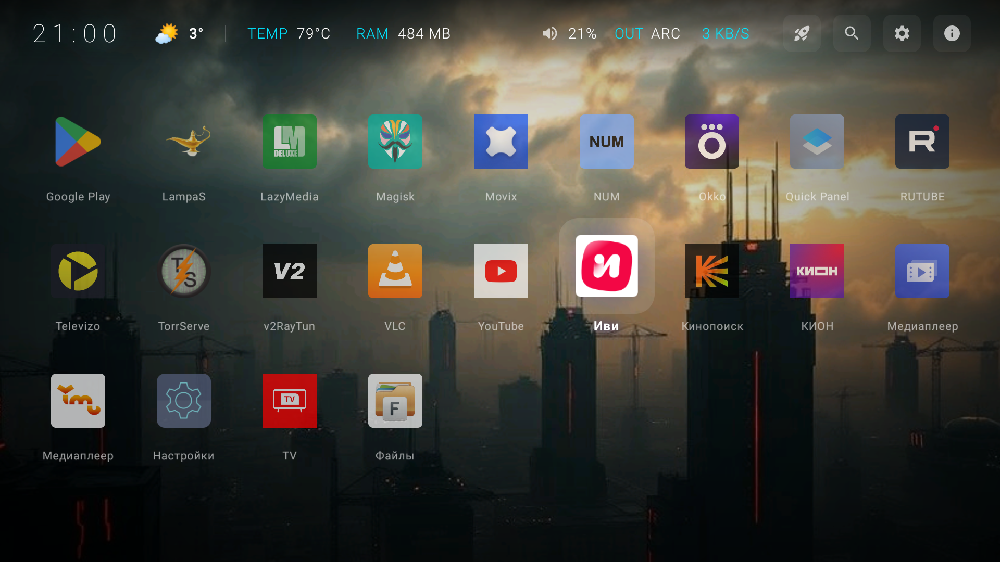
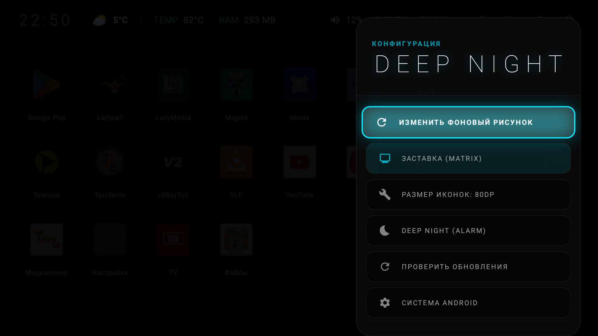
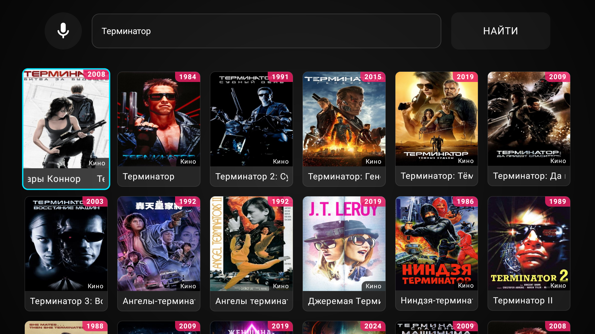

# DeepNight Ultimate (Custom Launcher ROOT)

**DeepNight Ultimate** — интегрированная медиа-экосистема для Android TV и ТВ-приставок. Не просто лаунчер, а единая оболочка на нативном C++ ядре и Jetpack Compose. Внутри — DSP-звук, DeepTunnel PRO, ИИ-студия, офлайн-TTS, IPTV, радио, торрент-агрегатор, игры и root-инструменты. Максимум возможностей при минимальном потреблении ресурсов.

> 💡 *Редкое сочетание функций, которого нет в большинстве традиционных лаунчеров для Android TV.*

---

## 📸 Скриншоты

  
  
  

---

## ⚡ Ключевые возможности

### ⚙️ Нативное C++ ядро (DeepNightEngine)
- **Минимальная нагрузка на ресурсы:** Тяжелая математика (FFT-анализ аудио, фонетический поиск, стемминг, парсинг медиаданных) вынесена в C++ код, что обеспечивает плавную работу на TV-приставках с ограниченным железом.
- **Инфо-панель (Dashboard):** Мониторинг температуры процессора (CPU), оперативной памяти (RAM) и скорости сети в реальном времени.

### 🛠 Системные функции и ROOT-инструменты
- **Оптимизация (Boost):** Очистка фоновых процессов и системного кэша.
- **T-Guard & RW-remount:** Расширенные инструменты для опытных пользователей (правка партиций `/product`, `/vendor`, `/odm`, оптимизация системных лимитов).
- **Управление питанием:** Быстрый доступ к перезагрузке и выключению устройства через системные сервисы.

### 🌐 Сеть, Трафик и VPN
- **Режим стабильного медиатрафика:** Локальная фрагментация пакетов (DeepTunnel PRO) для оптимизации передачи потокового видео.
- **Встроенный VPN (АнтиЗапрет):** Интегрированный OpenVPN-клиент для работы с локальным конфигурационным файлом (`antizapret.ovpn`).
- **Мониторинг соединений:** Автоматическое определение активных интернетов и типов аудиовыхода (HDMI, ARC, Bluetooth, USB, AUX).

### 🤖 ИИ-Студия и Голос
- **Мульти-модельная ИИ-студия:** Интеграция с облачными провайдерами (Gemini, OpenAI, Groq, GigaChat) для ассистента и рекомендаций.
- **Офлайн-TTS и VAD:** Озвучивание текста и детектор голоса непосредственно на устройстве без задержек.

### 🎬 Медиа, Поиск и Интеграции
- **Без необходимости устанавливать десятки отдельных приложений:** Ключевые модули (IPTV, Радио, Торрент-агрегатор, Игры, Погода) встроены непосредственно в оболочку.
- **Нативная программная обработка звука:** Эквалайзер и визуализаторы на базе C++ DSP.
- **Умный поиск:** Глобальный фонетический поиск по контенту и совместимость с TorrServe-клиентами.

---

## 📋 Требования к системе

- **Платформа:** Android TV / ТВ-приставка (Android 9.0 и выше)
- **Первичная настройка:** Работает сразу после первичной настройки; часть функций требует дополнительной конфигурации.
- **Для Root-режима:** Наличие Root-прав (Magisk / APatch) и модуля NFQUEUE.
- **Для ИИ-модулей:** Интернет-соединение и пользовательские API-ключи (Gemini / OpenAI / Groq / GigaChat).
- **Для торрент-плеера:** Стабильный интернет и совместимый TorrServe-клиент.
- **Для RW-remount и правки разделов:** Предназначено исключительно для опытных пользователей.

---

## ⚠️ Дисклеймер

> **ВАЖНО:** Root-функции, изменение системных разделов (`/product`, `/vendor`, `/odm`) и использование низкоуровневых скриптов могут привести к потере гарантии и повреждению операционной системы. Пользователь несёт полную ответственность за использование торрент-источников, сторонних API и соблюдение местного законодательства.

---

## 📦 Установка и запуск

1. Скачайте нужный APK из раздела [Releases](https://github.com/Igor1974/Custom-Launcher-ROOT-/releases):
    - **`armeabi-v7a`**: Для большинства ТВ-приставок и ТВ (32-бит).
    - **`arm64-v8a`**: Для 64-битных устройств (Nvidia Shield, Chromecast 4K).
    - **`universal`**: Универсальная сборка.
2. Установите приложение на Android TV.
3. При необходимости предоставьте ROOT-права в Magisk/APatch для активации системного Boost и управления питанием.

---

## 🛠 Технический стек

- **Языки:** Kotlin, C++20 (DeepNightEngine NDK)
- **UI:** Jetpack Compose TV / Material 3
- **Network & Audio:** OkHttp 4, OpenVPN Core, C++ FFT/DSP Audio Pipeline
- **Shell:** libsu (ROOT interop)

---
**Разработчик:** Igor1974  
**Версия:** DeepNight Ultimate 5.5.7  
